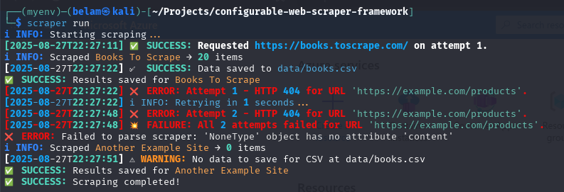
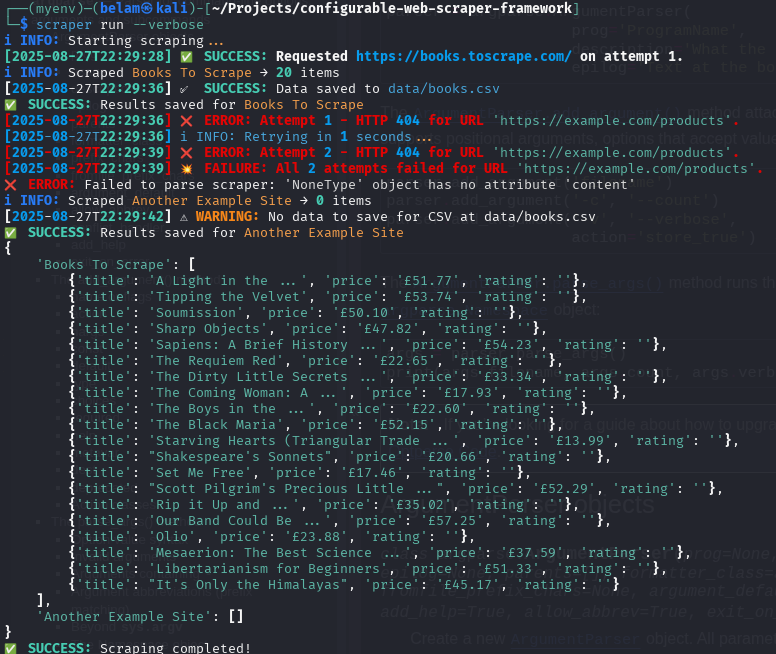
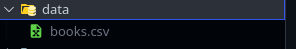

# Configurable Web Scraper Framework

## Introduction

This project is a modern web scraper that extracts data from websites using a YAML-based configuration. Users specify the data they want to scrape through the configuration file.

## Features

1. Full YAML configuration
2. Modular and efficient architecture
3. Command-line integration
4. Fetching data from websites
5. Retry and backoff strategies

## Project Structure

```bash
|-- data
|   -- {name provided in config}.csv
|   -- {name provided in config}.json
|-- scraper
|   |-- __init__.py           # Turns the scraper directory into a Python package
|   |-- cli.py                # Handles CLI commands for the scraper
|   |-- pipeline.py           # Manages the overall scraping pipeline
|   |-- framework.py          # Provides scraper functionality
|   |-- data_exporter.py      # Handles data export functionality
|   |-- fetcher.py            # Handles fetching web pages
|   |-- parser.py             # Handles parsing of web pages
|-- config
|   |-- __init__.py           # Turns the config directory into a Python package
|   |-- config_utils.py       # Provides helper functions for configuration
|   |-- config.yaml           # Main configuration file for the scraper
|-- tests
|   |-- __init__.py           # Turns the test directory into a Python package
|   |-- test_fetcher.py       # Unit tests for the fetcher module
|-- __init__.py               # Turns entire scraper into a Python package
|-- .gitignore                # Defines ignored files for Git
|-- Jenkinsfile               # Jenkins pipeline configuration
|-- requirements.txt          # Python dependencies
|-- setup.py                  # Packaging and installation script
```

## Installation

To install this scraper locally, you need:

* Python 3.7 or higher
* pip (Python package installer)

Run the following commands:

1. Clone the repository:

```bash
git clone https://github.com/bmuia/configurable-web-scraper-framework.git
cd configurable-web-scraper-framework
```

2. Install the required packages:

```bash
pip install -r requirements.txt
```

3. Install the package:

```bash
pip install -e .
```

That's it!

## Usage

1. Open the configuration file:

```bash
config/config.yaml
```

2. Modify the configuration under `scrapers`:

```yaml
- name: "Books To Scrape"
  base_url: "https://books.toscrape.com/"
  max_retries: 3
  back_off: 2
  item_container_selector: ".product_pod"
  fields:
    - name: title
      selector: "h3 a"
    - name: price
      selector: ".price_color"
    - name: rating
      selector: ".star-rating"
  output:
    type: csv
    path: "data/books.csv"
```

**Note:** Adjust selectors to match the website’s structure. You can add multiple YAML configurations for different websites, pages, or data types.

3. Run the scraper:

```bash
# Run without printing results to the console
scraper run
```

```bash
# Run and print results to the console
scraper run --verbose
```

4. Check the output:
   Scraped data will appear in the `data` directory in the specified format (CSV or JSON).

## Sample Output

Here are some examples of the scraper running with and without the verbose flag, and the data directory:

* Without verbose:
  
* With verbose:
  
* Data directory:
  

## Troubleshooting

If you encounter issues:

1. Ensure the target website is accessible and not blocking requests.
2. Verify that selectors in the configuration file match the website structure (use browser developer tools).
3. Check logs for error messages or stack traces.
4. Reach out to me ([belam](mailto:belammuia0@gmail.com)) or open a GitHub issue.

## Contributing

Contributions are welcome! Submit a pull request or open an issue.

## Resources

* [Requests](https://docs.python-requests.org/en/master/) for handling HTTP requests.
* [Beautiful Soup](https://www.crummy.com/software/BeautifulSoup/bs4/doc/) for parsing HTML and XML documents.
* [PyYAML](https://pyyaml.org/) for YAML parsing and serialization.

## License

This project is licensed under the MIT License – see the [LICENSE](LICENSE) file for details.

## Conclusion

This configurable web scraper framework is designed for flexibility and ease of use. With its modular architecture and YAML configuration, you can quickly set up and run scrapers for different websites and data types.
Happy scraping!
